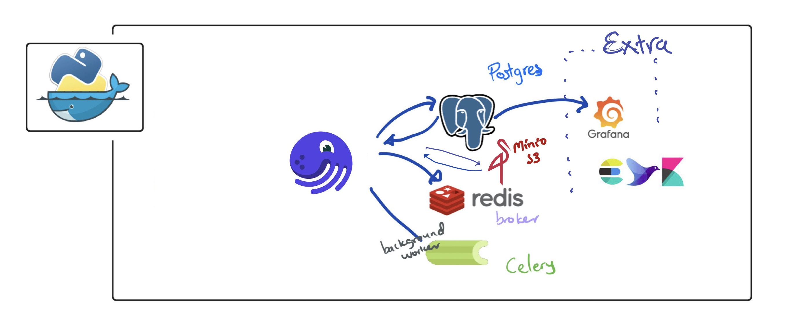

# Advance Web Scraping
> Using airflow to schedule, monitor, and log. Postgres as backend and data storage. Redis as a broker



### Getting Started
Check list to start our services first time

- [ ] make sure that docker is running and volume mounting is enable.
- [ ] git clone [advance_scraping](https://github.com/Proteusiq/advance_scraping.git)
- [ ] set your environment variables
- [ ] run the service with a single docker-compose command

### Git Clone
```bash
git clone https://github.com/Proteusiq/advance_scraping.git
cd advance_scraping
```


### Set Environment Variables

Unix users can just edit `.env` contents.
> **WARNING**: Remember to add your .env to .gitignore. Don't share your secrets

Another way for both Unix and Windows. Change the contents of `environment_example` (unix users) and `environment_example_windows` (windows users) 

Unix users can do:

```bash
source environment_example
```

Windows users, need to `select all` and `copy-paste` to  command line `cmd.exe`.(powershell won't work).

##### Check the environments to be set by docker-compose with:

```bash
docker-compose config
```

### Start services with a single command:

```bash
docker-compose up
```

## UI Services:

- ### Airflow: `address:` __localhost:8080__ `default_user:` __danpra__ `default_pwd`: __changeme__
- ### pgAdmin: `address:` __localhost:5050__ `default_email:` __pgadmin@example.com__ `default_pwd`: __admin__
- ### Flower: `address:` __localhost:5555__ 

#### Postgres Admin Tool
Head to `localhost:5050`. Login with creditials used in your environment variables. Example: `danpra@example.com` and password `postgrespwd`


Adding connection to `postgres` db in `pgAdmin`, click `Add New Server`. Type any name and select `Connection`. Name:Boliga > Host name/address: `postgres`: Postgres Username and Password and click `Save`
  
  


### Stop services with:
Press `Ctrl + C` to stop our services without killing your volumes data. Then do

```bash
docker-compose down
```

Use docker-compose down -v to remove also the volumes. 
> **WARNING**: remember to backup your data before removing volumes. 

```bash
docker-compose down -v
```

### Todo:
- [ ] Add a web-scraper examples
- [ ] Add simple Airflow examples
- [ ] Add introduction to Airflow  README


#### Repos that made this project possible and lots of github issues:

 [Docker Apache Airflow](https://github.com/puckel/docker-airflow)


Docker Basics:

Kill all containers
```bash
docker container ps | awk {' print $1 '} | tail -n+2 > tmp.txt; for line in $(cat tmp.txt); do docker container kill $line; done; rm tmp.txt
```
