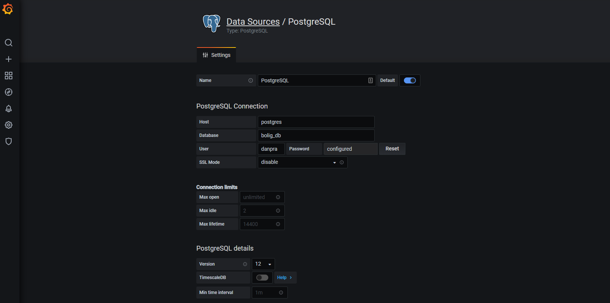

# Advance Web Scraping
> Using airflow to schedule, monitor, and log. Postgres as backend and data storage. Redis as a broker

## Update: 2022-04-18
Migrating to Dagster plans


### Getting Started
Checklist to start our services

- [ ] make sure docker is running, and volume mounting is enabled.
- [ ] git clone [advance_scraping](https://github.com/Proteusiq/advance_scraping.git)
- [ ] set environment variables
- [ ] run the service with a single docker-compose command

### Git Clone
```bash
git clone https://github.com/Proteusiq/advance_scraping.git
cd advance_scraping
```


### Set Environment Variables

Set correct environment variables in all `*.env`. E.g. edit the `.env_demo` contents and save it as `.env`<br>
Each service has `service.env`. Edit them as you see fit.
> ⚠️ **WARNING**: Remember to add  `*.env` to .gitignore. Do not share your secrets. All `*.env` are left here for demonstration.

##### Check the environments to be set by docker-compose with:

```bash
docker-compose config
```

Make sure you can see the environment variable docker-compose fetches from `.env`

See: [docker-compose](https://docs.docker.com/compose/reference/overview/) options.

<br>
<details><summary>Slack Integration</summary>
<p>

### How to Step-up Slack
Checklist to set slack integration

 - [ ] Create [Slack APP](https://api.slack.com/apps/) for a given channel
 - [ ] In `OAuth Tokens for Your Workspace` get the Bot User OAuth Token and set it in .env SLACK_TOKEN
 - [ ] Set `Bot Token Scopes` to `chat:write.customize`
 - [ ] Extra `Restrict API Token Usage` whitelist IP Address
 - [ ] In a given channel invite the bot e.g. `@BotName`

</p>
</details>

<br>

### Start services with a single command:

> **WARNING**: Postgres container has an issue with persisting data after a restart. Until then, we will use labelled volume
> Do `docker volume create --name=pgdata` to create a named volume (to delete `docker volume rm pgdata`)

```bash
docker-compose up
```

Note: _Only the initial build_ will take a while. Go grab a cup of coffee as docker downloads and install the necessary tools. 
You can run the services in detach mode. `--detach` or `-d` flag. This will leave services running.

See: [docker-compose up](https://docs.docker.com/compose/reference/up/) options

## UI Services:

- ##### Airflow:  `address:` __localhost:8080__ `default_user:` __danpra__ `default_pwd`: __changeme__
- ##### pgAdmin: `address:` __localhost:5050__ `default_email:` __pgadmin@example.com__ `default_pwd`: __admin__
- ##### minio: `address:` __localhost:9000__ `default_key:` __danpra__ `default_secret:` __miniopwd__

## Extra [not part of defaults]
- ##### Ridis Insight: `address:` __localhost:8001__ 
- ##### Grafana: `address:` __localhost:3000__  

#### Airflow UI
Head to `localhost:8080` on your browser. Login with credentials used in your environment ADMIN_USER and ADMIN_PASSWORD variables. Example: `danpra` and password `airflowpwd` 

#### Postgres Admin Tool
Head to `localhost:5050`. Login with credentials used in your environment PGADMIN_DEFAULT_EMAIL and PGADMIN_DEFAULT_PASSWORD variables. Example: `danpra@example.com` and password `postgrespwd`


Adding a connection to `postgres` DB in `pgAdmin`, click `Add New Server`. Type any name and select `Connection`. Name:Boliga > Host name/address: `postgres`: Postgres Username and Password and click `Save`
  
  


<br>
<details><summary>Extra Services</summary>
<p>

 #### 
 > Using efk.yml to add more services [not part of the default]
 ### Grafana
 Head to `localhost:3000`. Login with user `admin` and password `grafanapwd`. Change credentials in `containers/grafana/config.monitoring`. Add Postgres as a data source with the Postgres username and password as we did in pgAdmin.

 
> Charts coming soon
</p>
</details>
<br>

# Airflow's Architecture:


> source: [Airflow Celery Executor](https://airflow.apache.org/docs/apache-airflow/stable/executor/celery.html)


### Stop services with:
Press `Ctrl + C` to stop our services without killing your volumes data. Then do

```bash
docker-compose down
```

Use docker-compose down -v to remove also the volumes. 
> **WARNING**: remember to backup your data before removing volumes. 

```bash
docker-compose down -v
```
See: [docker-compose down](https://docs.docker.com/compose/reference/down/) options
### Web Scraping and Design Pattern [Opinionated Rumbling]
A lazy programmer, like me, loves to write less yet comprehensive codes. (:) Yes, I said it). Design Pattern in Python is not as useful and, in most cases, an overkill as other languages like Java, C#, and C++. To design a simple bolig[_danish for estate_] scrapping tool from different estate websites in Denmark, I decided to use a bit of Singleton Pattern and Abstract Factory Pattern.

Bolig (`webscrapers.abc_estates.Bolig`) ensures a single instance and single object that can be used by all other bolig related classes. The form of singleton design is Early Instantiation. We create an instance at load time. 

Bolig class also defines an interface[abstract class] for creating families of related objects without specifying their concrete sub-classes[functions]. This ensures consistency among all objects by isolating the client code from implementation. We want to use the same function but with different implementations. `get_page` and `get_pages` will always be called in the same way, but the implementation is different.

```python
# inheritance tree
Bolig                   # singleton and abstract
Boliga(Bolig)           # overides get_page and get_pages for boliga.dk api logic
Services(Bolig)         # overides get_page and get_pages for home.dk and estate.dk api logic
BoligaRecent(Boliga)    # initiate with recent boliga as url
BoligaSold(Boliga)      # initiate with sold boliga as url
Home(Services)          # initiate with home recent home as url
Estate(Services)        # initiate with estate recent home as url
```


### Todo:
- [X] Add a web-scraper examples
- [ ] Add simple Airflow examples
- [ ] Add an introduction to Airflow  README
- [ ] Add custom error handling class
- [ ] Add tests Airflow dags and Scrapers
- [ ] Add Grafana visualization of tasks and estates prices


#### Repos that made this project possible and lots of Github issues:

 [Docker Apache Airflow](https://github.com/puckel/docker-airflow)


Docker Basics:

Kill all containers
```bash
docker container ps | awk {' print $1 '} | tail -n+2 > tmp.txt; for line in $(cat tmp.txt); do docker container kill $line; done; rm tmp.txt
```
